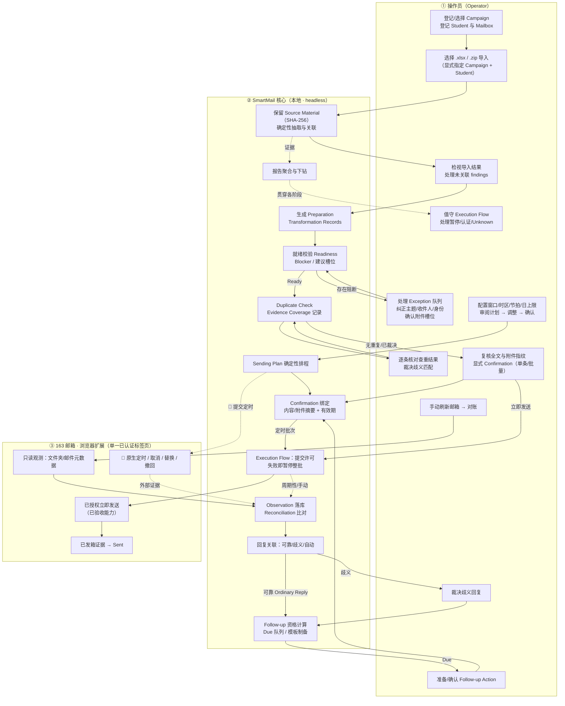
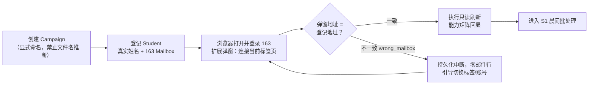
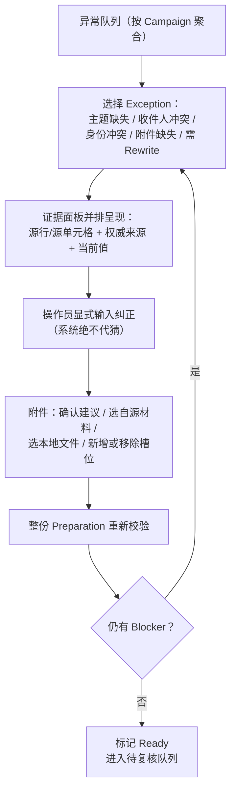
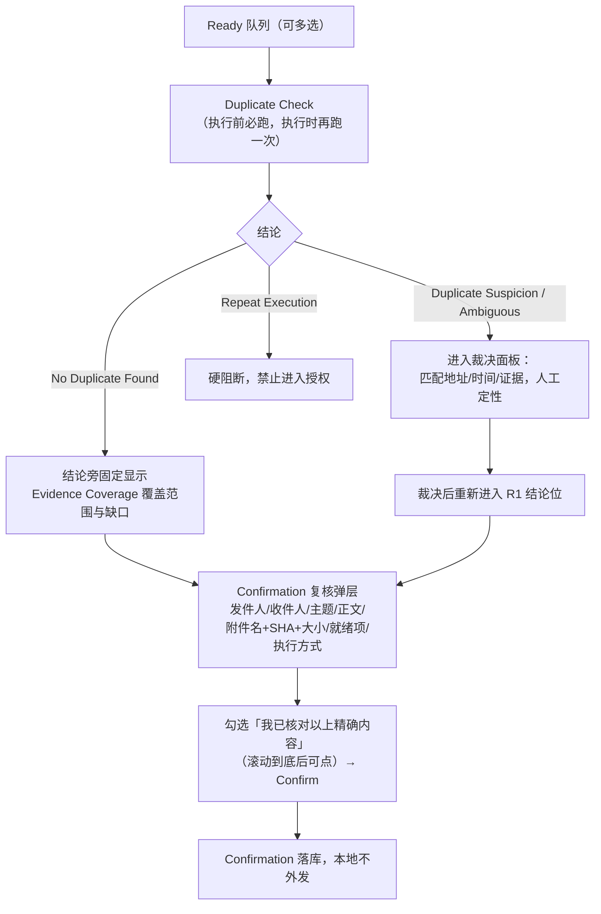
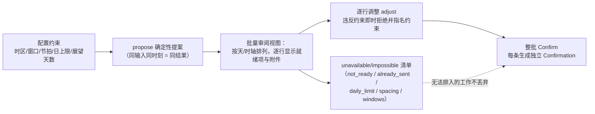
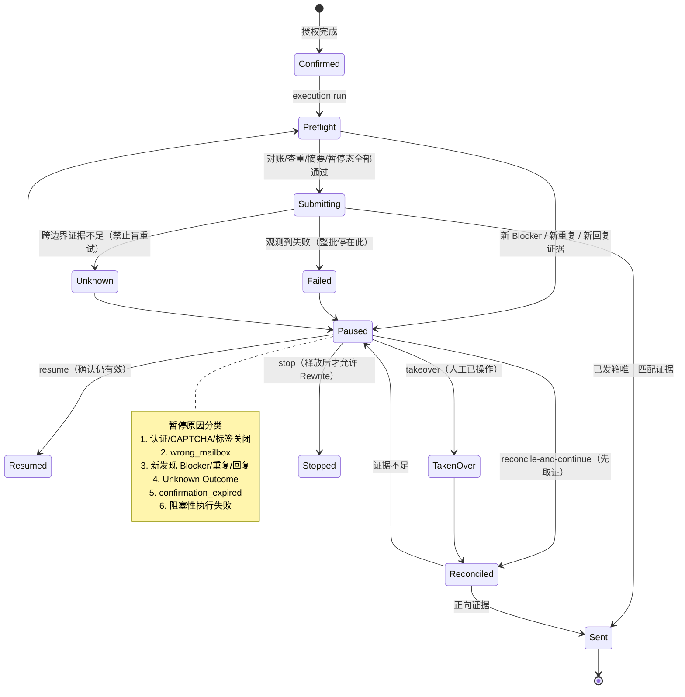
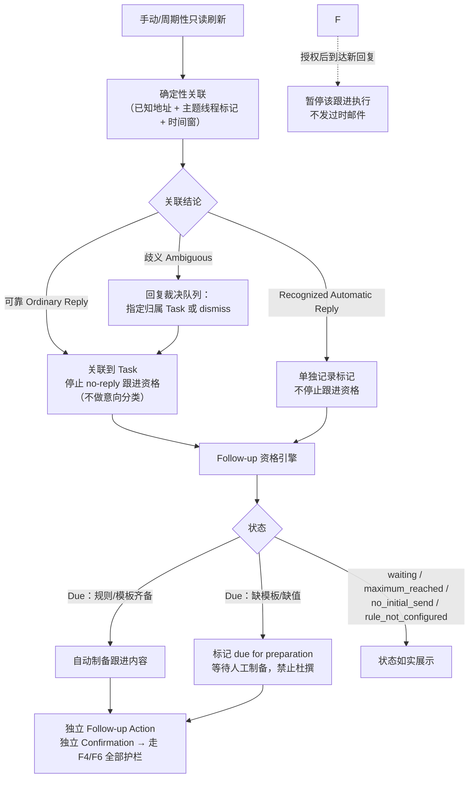

# SmartMail 运营工作台 · 01 Workflow Map（用户工作流地图）

| 项 | 内容 |
|---|---|
| 项目 | SmartMail — Supervisor Outreach Operations（硕导套磁邮件运营系统） |
| 交付物 | 1/3 · Workflow Map |
| 版本 | v0.1（待评审） |
| 日期 | 2026-09-14 |
| 设计边界 | **概念设计阶段，不含任何代码改动**。工作台是架设在既有 headless 命令/查询边界之上的表现层；终端 Shell 与浏览器扩展弹窗的既有职责不变 |
| 术语 | 以 [CONTEXT.md](../../CONTEXT.md) 领域词汇表为准，正文采用「中文（English Canonical Term）」双语标注 |
| 导航 | 01 Workflow Map（本文） · [02 Information Architecture](./02-information-architecture.md) · [03 Primary Workspace Wireframe](./03-primary-workspace-wireframe.md) |

---

## 1. 背景、目标与设计边界

### 1.1 为什么需要工作台

SmartMail 已以终端形态跑通完整运营链路（Tickets 01–11）：导入 → 自动制备 → 异常消解 → 查重 → 授权 → 执行 → 对账 → 回复关联 → 跟进 → 报告。但 CLI 对"一人运营数百个 Outreach Task"的场景存在三重负担：

1. **认知负担**：工作状态散落在十余条命令的 JSON 输出里，缺少全局在制（WIP）视图；
2. **切换负担**：证据核对要在 `task show` / `preparation preview` / `imports show` / `source open` 之间反复跳转；
3. **安全负担**：Confirmation（授权）、Execution Flow 暂停、Unknown Outcome（结果未知）等高风险节点没有视觉化的"防错装置（Poka-Yoke）"。

工作台的设计目的不是替代核心，而是把**同一条命令/查询边界**重新组织为"队列驱动、证据随行、闸门确认"的运营界面。

### 1.2 设计目标（可检验）

| # | 目标 | 设计承诺 |
|---|---|---|
| G1 | 批处理效率 | 操作员一次坐班可完成"异常清零 → 批量复核 → 一次授权"，高频动作 ≤ 3 次点击 |
| G2 | 零未授权外发 | 任何外发/定时/取消操作必须经过显式 Confirmation 闸门；就绪（Ready）永远不等于授权 |
| G3 | 异常零遗漏 | 所有 Exception、歧义匹配、歧义回复、Unknown Outcome 都进入显式队列并带计数徽标 |
| G4 | 证据可追溯 | 每条字段、每个附件、每个状态结论都可一键下钻到 Source Association、SHA-256 快照或 Evidence Coverage |
| G5 | 状态诚实 | "未发现重复（No Duplicate Found）"必须带覆盖度限定；Unknown 不得显示为失败或成功 |
| G6 | 中断不停摆 | Execution Flow 暂停期间，本地制备、报告、其他批次工作完全可用，暂停原因与恢复动作始终可见 |

### 1.3 设计边界（不可突破的领域规则）

- 单一操作员、单机、单本地存储（SQLite）；无角色/权限/多人协作设计。
- 仅确定性规则：界面不出现"AI 润色/智能分类/猜你想发"；Ordinary Reply（普通回复）不做意向分类。
- 浏览器扩展弹窗**仍然只是连接控制器**；制备与授权在工作台完成。
- 默认适配器 disabled（禁用外发）；每个邮箱能力（读信、立即发送、定时、撤回）独立开关、独立验收状态。
- Ticket 12 能力（外部定时、Cancellation 取消、Recall 撤回、Scheduled Replacement 定时替换）在本文以 **🧭 路线图**标记，界面预留位置但不宣称可用。

---

## 2. 角色与典型场景

### 2.1 Persona

**林岚 · 教育申请机构运营专员（Operator）**，26 岁，供应链管理硕士在读。同时为 30–80 名学生运营硕导套磁邮件，每人对应 5–20 位 Supervisor。每天在多个 163 邮箱、Excel 总表、学生陆续发来的修订版 .docx、PDF 附件之间切换。她不是开发者，能熟练使用浏览器和表格工具；她需要系统替她做"确定性的杂务"，但**每一封真正发出去的邮件必须由她拍板**。

她的作品集诉求（本设计的叙事主线）：

> 用运营管理（Operations Management）的方法治理一条"沟通生产线"——流水线分阶段、质量门前置、异常队列化、批量与节拍可配置、全过程证据链、人机分工边界清晰。

### 2.2 五个关键使用场景

| 场景 | 频率 | 入口 | 成功标准 |
|---|---|---|---|
| S1 晨间批处理：清异常 → 批量授权 → 启动执行 | 每日 1 次，30–60 分钟 | 工作台 Dashboard | 阻断项清零；每封邮件均看过全文与附件；一次 Confirmation 完成整批 |
| S2 执行值守：处理暂停与认证中断 | 每日数次，碎片化 | 顶部连接状态 + 执行监控 | 暂停原因可在 10 秒内读懂；恢复/接管/对账动作不被误点 |
| S3 学生临时修订：Rewrite 与重新授权 | 每周数次 | 任务详情 / 导入批次 | 旧版自动隐藏但可查；旧授权不转移；新外发必须重新确认 |
| S4 回复与跟进闭环 | 每日或隔日 | 回复与跟进 | 歧义回复全部人工裁决；Follow-up Due 不遗漏；跟进邮件各自独立授权 |
| S5 运营汇报与回溯 | 每周 | 报告 | 按 Student/Supervisor/状态多维筛选，数字可逐级下钻到证据 |

---

## 3. 全局工作流阶段图

### 3.1 三泳道端到端流程

泳道：**① 操作员** · **② SmartMail 核心（本地）** · **③ 163 邮箱（经浏览器扩展）**。虚线框为 🧭 Ticket 12 路线图能力。

### 3.2 阶段总览（信息如何流过系统）

| 阶段 | 名称 | 核心动作 | 退出条件（质量门） |
|---|---|---|---|
| 0 | 设置与连接 Setup | 建 Campaign、登记 Student/Mailbox、连接扩展 | 扩展弹窗显示与登记一致的邮箱地址 |
| 1 | 导入与检视 Intake | 导入既有材料，不动原始字节 | 操作员看到成功关联清单与未关联 findings |
| 2 | 自动制备 Preparation | 确定性抽取收件人/正文/内研笔记分离 | 每条草稿 0 或 1 个 Preparation，全部有 Transformation Record |
| 3 | 就绪与异常 Readiness | 纠正字段、确认身份、确认/替换附件槽位 | Preparation = Ready（但**不授权**） |
| 4 | 查重 Duplicate | 历史已发 + 邮箱观测联合比对 | 无重复，或歧义/疑似已被人工裁决 |
| 5 | 复核与授权 Confirmation | 核对精确内容与指纹后显式授权 | Confirmation 绑定摘要；内容变更即失效 |
| 5′ | 排程 Plan（可选） | 配置约束 → 提案 → 调整 → 整批确认 | 每个时间都满足窗口/节拍/日上限 |
| 6 | 执行与干预 Execution | 适配器顺序执行，遇阻即暂停 | Sent（外部证据）或显式停止/接管 |
| 7 | 观测与对账 Reconciliation | 只读刷新，比对差异，记录覆盖度 | 差异显式化；Unknown 不转失败 |
| 8 | 回复与跟进 Follow-up | 关联裁决 → 资格计算 → 跟进制备 | 跟进是独立 Action，独立 Confirmation |
| — | 报告 Reporting | 多维筛选、逐级下钻 | 每个汇总数字可下钻到任务与证据 |

---

## 4. 关键流程详设

### F1 首次/新 Campaign 配置流程

- **设计要点**：连接状态在顶栏全局常驻（绿点+邮箱地址）；`wrong_mailbox`、未登录、CAPTCHA、Native Host 不可用各有独立文案与排查动作；SmartMail 永不接触密码/Cookie。

### F2 导入 → 自动制备（Intake）

1. 全局 **＋导入**：选择文件 → 两个必选作用域选择器（Campaign、Student），不提供默认猜测。
2. 导入结果页三段式：**成功关联（Tasks）/ 未形成单一 Preparation 的 findings / 保留材料清单（文件名、大小、SHA-256）**。
3. `source open` 在界面中为每条材料的"打开原件"操作（系统默认应用打开副本，原件字节不可变）。
4. 若 Task 已有活跃 Preparation，新草稿不覆盖：产生阻断项 `replacement_requires_rewrite`，引导进入 **F3-Rewrite 支路**。

### F3 异常消解就绪回路（Readiness Loop）

- Rewrite 支路：仅当无活跃 Execution Attempt 时允许；停止（stop）未决尝试后才能 Rewrite → 生成**全新 Preparation 身份**，旧版变 Superseded（从活跃列表消失，历史可查），纠正项/附件/Confirmation **一律不继承**。
- 已 Sent 的 Preparation 永不可 Rewrite：后续沟通只能新建链接的 Communication Action。

### F4 查重 → 复核 → 授权（安全主路径）

**授权闸门设计铁律**：

- Ready 与 Confirmed 在视觉上是两个独立状态，两处不同 CTA，不允许"就绪即发送"的一键路径；
- 弹层展示的是**冻结快照**，与最终提交前 Native Host 复核的是同一批摘要；
- 支持 `expires-at` 有效期；过期后必须重新确认，系统永不把过期定时降级为立即发送。

### F5 Sending Plan 确定性排程

- 调整已带 Confirmation 的行动作会使其失效、计划回到 proposed；未确认的旧提案被取代但可查。
- 🧭 确认后的本地计划 ≠ 外部定时：Ticket 12 落地前，`execution run` 拒绝定时工作；过期时间触发 `confirmation_expired` 暂停。

### F6 执行监控与中断恢复（最需要防错设计的流程）

执行状态机与暂停原因分类：

**暂停控制台（Paused Banner）的上下文动作规则**：

| 暂停原因 | 主按钮 | 次按钮 | 禁止的动作 |
|---|---|---|---|
| 认证/CAPTCHA | 我已完成登录（重连） | 查看排查指引 | 自动重试提交 |
| Unknown Outcome | 先对账（reconcile） | 记录人工接管 | 直接再发一次 |
| 新 Blocker/重复 | 去查看证据 | stop 后 Rewrite | 忽略继续 |
| confirmation_expired | 改新时间并重新授权 | — | 立即发送 |
| 阻塞性失败 | 查看失败证据 | stop / takeover | 越过该条继续 |

暂停期间：左侧导航其余区域全部可用；外部已定时承诺 🧭 继续在"执行监控"页置顶可见，本地暂停≠取消外部定时。

### F7 回复关联 → 跟进闭环

### F8 观测与对账（Reconciliation）

- 入口：顶栏连接区"立即刷新"、Mailbox 页"手动刷新"、所有强制对账触发点（执行前/不确定后/重启恢复时）。
- 每次刷新持久化：Observation、平台 canonical ID、列表+详情双层证据、能力快照、**逐文件夹 Evidence Coverage**（声明总数/枚举数/请求页数/详情成败数）。
- 界面必须表达："支持范围内的完整"≠"整个邮箱完整"；虚拟视图、未识别自定义文件夹、正文 HTML 不在覆盖内。
- 直接在邮箱里的人工改动：记录、不自动恢复、不继承旧 Confirmation（🧭 Ticket 12 细化，当前预留差异提示位）。

### F9 🧭 路线图：定时、取消、替换、撤回（Ticket 12）

- 原生定时：仅扩展通道；以外部证据标记 Externally Scheduled；本地应用离线也由邮箱执行；时钟流逝 ≠ Sent。
- 取消 Cancellation：显式确认；观察到移除才算成功；若邮件已 Sent，冻结 Sent Record 并告知取消未阻止发送。
- Scheduled Replacement：**先验证旧定时草稿已移除，再提交新件**；移除成功但提交失败 → 暂停且不自动恢复旧件；原件若已发出 → 冻结并要求新建链接 Action。
- Recall 撤回：能力独立开关、平台资格条件满足才出现入口；结果与 Sent 历史事实分开记录，永不承诺"撤回成功"。
- 工作台在 IA 与线框中预留这些控件的位置，但用"能力未验收"禁用态呈现，不可点击。

---

## 5. 交互路径地图（Navigation Path Matrix）

| 用户目标 | 入口 | 路径 | 终点/下钻 |
|---|---|---|---|
| 今天先做什么 | Dashboard | 队列卡片排序：执行暂停 → 阻断异常 → 歧义回复 → Follow-up Due | 点击计数直达筛选后的列表 |
| 导入新材料 | 顶栏 ＋导入 | 选文件 → 选 Campaign → 选 Student → 结果三段式 | 单条 Task 详情 |
| 清空异常 | 制备工作台 | 异常队列 → 并排证据 → 纠正/附件 → 自动重校 | Ready 队列 |
| 核对一封邮件 | 任意列表行 | 任务详情 → 制备内容 Tab → 预览全文 | 原件/转换记录/附件快照 |
| 批量授权 | Ready 队列 | 多选 → 批量复核（逐条翻阅冻结内容）→ Confirm | Confirmation 列表 |
| 安排发送节拍 | 发送计划 | 配置 → 提案 → 日历时轴审阅 → 逐行调整 → 整批确认 | 计划详情 |
| 处理执行暂停 | 全局 Banner | 看原因 → 上下文动作（重连/对账/接管/停止） | Attempt 详情与证据 |
| 查某封到底发没发 | 执行监控 | Attempt → 外部证据 → Sent Record（冻结） | 不可变全文 |
| 裁决回复 | 回复与跟进 | 歧义队列 → 证据（地址/主题/时间）→ 指定 Task / 排除 | 资格状态即时更新 |
| 发跟进 | Follow-up Due | 制备（模板/人工）→ 独立复核 → 确认 → 执行 | 与主流程共享护栏 |
| 向上汇报 | 报告 | 维度筛选 → 汇总卡 → 任务清单 → 单任务证据 | 可导出视图 |

**下钻与返回规则**：所有汇总数字 → 列表（带筛选条件回显）→ 详情（证据 Tab 直达对应锚点）；面包屑保留作用域（Campaign > Task > Action）；抽屉内下钻不覆盖列表滚动位置。

---

## 6. 工作流级 UX 模式（跨页面一致的设计语言）

1. **质量门分离（Quality Gates）**：Prepared → Ready → Confirmed → Sent 是四个不可合并的台阶，每级颜色、图标、CTA 均不同。
2. **队列即待办（Queues as Work）**：阻断异常、歧义匹配、歧义回复、Follow-up Due、Unknown/Paused 五个队列在 Dashboard 与导航徽标中口径一致（同一查询）。
3. **证据随行（Evidence at Hand）**：任何系统结论行尾都有"依据"图标，点开即 Source Association / Coverage / 快照指纹，不让操作员离开当前情境。
4. **诚实的不确定性（Honest Uncertainty）**：Unknown、未覆盖、未验收能力使用专门的"待定/条纹"视觉，不允许绿/红二元化。
5. **安全默认值（Safe Defaults）**：适配器默认禁用；破坏性动作（stop、rewrite、cancel 🧭）二次确认且说明后果；无"本次登录不再提示"。
6. **批量但不盲从（Batch with Review）**：支持多选批量操作，但 Confirmation 弹层强制逐条翻阅精确内容；排程约束冲突逐条指名。
7. **本地不停摆（Local Work Continues）**：外部暂停只冻结相关 Execution Flow，不锁定界面其余部分。

---

## 7. 流程风险与设计对策（FMEA 视角）

| # | 失效模式 | 后果 | 流程对策（界面承载） |
|---|---|---|---|
| 1 | 未读全文即批量授权 | 错误邮件外发 | 授权弹层强制滚动+勾选；展示附件 SHA 与大小；提交前二次摘要复核 |
| 2 | Unknown Outcome 后盲重试 | 重复发送 | Unknown 状态唯一主动作是"先对账"；reconcile 正向证据前禁止 run |
| 3 | 学生修订后旧授权被沿用 | 发出过时内容 | Rewrite 生成新身份且 Confirmation 不继承；活跃 Attempt 未 stop 前禁止 Rewrite |
| 4 | 错连邮箱标签页 | 错账号发信 | wrong_mailbox 零数据落库；顶栏常驻地址比对；提交前扩展校验认证账号 |
| 5 | 歧义回复被自动猜测 | 错误停止/错误跟进 | 歧义只进裁决队列；裁决前不影响资格，也不自动归类 |
| 6 | 把"未发现重复"当"绝对无重复" | 漏发防护误判 | 结论与覆盖度缺口同屏绑定，文案明确"非全邮箱证明" |
| 7 | 本地暂停被误解为取消外部定时 | 以为无发送承诺 | 外部定时承诺在暂停页置顶；🧭 取消是独立显式操作 |
| 8 | 排程违反窗口/节拍/日上限 | 违规时点外发 | adjust 即时拒绝并指名约束；impossible 项单列不硬塞 |
| 9 | 崩溃/重启后状态不明 | 重复提交或漏发 | 重启后强制对账入口；not_attempted 可安全复用，跨边界即 Unknown |
| 10 | 未验收能力被当作可用 | 承诺无法兑现 | 能力矩阵逐项 disabled/verified 徽标；🧭 控件禁用态并标注验收状态 |

---

## 8. 与供应链/运营管理方法论的对照（作品集叙事）

| 运营概念 | 在本流程中的体现 |
|---|---|
| 流水线与节拍（Pipeline & Takt） | 阶段 1–8 固定流向；Sending Plan 的 spacing/daily-limit 即可配置节拍与产能上限 |
| 质量门前置（Quality Gate） | Readiness、Duplicate、Confirmation 三道门，缺陷不向下游传递 |
| 异常管理（Rework Loop） | Exception/歧义/Unknown 全部回流到显式队列，闭环后才回主线 |
| 在制品可视化（WIP Visualization） | Dashboard 以队列计数呈现各阶段 WIP 与瓶颈 |
| 批处理经济（Batch Economics） | 批量复核+一次授权平衡切换成本与风险，批量内容仍逐条冻结 |
| 链条可追溯（Chain of Custody） | Source Association、Transformation Record、SHA-256 快照、Execution Ledger 构成证据链 |
| 人机分工（Automation Boundary） | 确定性杂务自动化；外部承诺（发送/定时/取消）保留人工授权点 |
| 控制塔（Control Tower） | Dashboard + 全局暂停 Banner + 能力/连接状态构成单一运营态势中心 |

---

> 下一步：阅读 [02 Information Architecture](./02-information-architecture.md)，了解这些流程如何落到导航、页面与信息分层；再阅读 [03 Primary Workspace Wireframe](./03-primary-workspace-wireframe.md) 查看主工作区线框。
