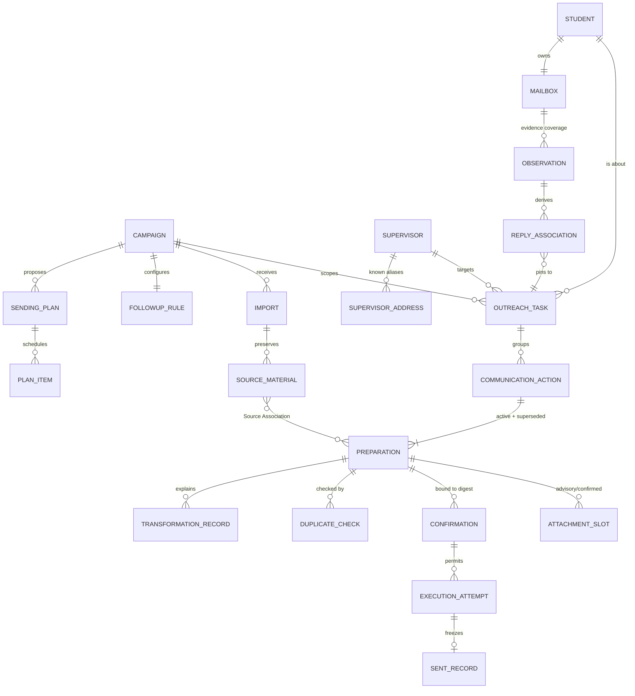

# SmartMail 运营工作台 · 02 Information Architecture（信息架构）

| 项 | 内容 |
|---|---|
| 交付物 | 2/3 · Information Architecture |
| 版本 | v0.1（待评审） |
| 日期 | 2026-09-14 |
| 输入依据 | [CONTEXT.md](../../CONTEXT.md) 领域词汇表、[phase-one spec](../../.scratch/smartmail-phase-one/spec.md)、`smartmail/cli/parser.py` 既有命令/查询边界（页面可追溯到命令） |
| 导航 | [01 Workflow Map](./01-workflow-map.md) · 02 Information Architecture（本文） · [03 Primary Workspace Wireframe](./03-primary-workspace-wireframe.md) |

---

## 1. IA 设计原则

1. **任务为脊柱（Task as the Spine）**：Outreach Task（Student × Supervisor × Campaign）是唯一贯通原材料、制备、授权、执行、回复、跟进、报告的对象；所有列表最终都能下钻到 Task。
2. **对象–动作分离（Object–Action Separation）**：导航按业务对象分区（任务/制备/计划/执行/邮箱/跟进/报告），动作出现在对象上下文中（行内操作、详情 CTA、批量操作条），不按动词建导航。
3. **作用域显式（Explicit Scope）**：Campaign 是全局作用域切换器，绝不从文件名、目录、上一次操作推断；Student/Mailbox 是二级筛选而非系统身份。
4. **状态优先于类型（Status-first Classification）**：队列页以运营状态组织（阻断/就绪/已授权/暂停/Due），实体类型只做次级分组——操作员的问题永远是"我现在该处理什么"。
5. **证据是一层，不是弹窗仓库（Evidence as a Layer）**：Source Material、Transformation Record、Evidence Coverage、摘要指纹作为与业务内容并排的"证据层"，任何结论可就地核验。
6. **外发承诺单独成区（External Commitments Apart）**：本地制备与外部状态（Sent / Externally Scheduled 🧭 / Unknown）分区呈现，防止把本地计划误认为邮箱现实。
7. **能力可见且诚实（Capability Honesty）**：disabled / 未验收 / 已验收的邮箱能力在全局与页面两级显式呈现。

---

## 2. 信息对象模型（Content Model）

工作台不新增业务对象，只对既有领域对象做界面组织。下图为导航与页面设计的权威对象关系：



**对象层级（用于面包屑与详情嵌套）**：

```
Campaign
└── Student / Supervisor / Institution（维度，非容器）
    └── Outreach Task（脊柱对象）
        └── Communication Action（initial outreach / linked follow-up）
            ├── Preparation 版本序列（1 个 Active，N 个 Superseded）
            │   ├── 字段（sender/recipients/subject/body）+ 权威来源
            │   ├── Attachment Slots（建议 → 已确认快照）
            │   ├── Readiness Findings（blocking / advisory）
            │   └── Transformation Records
            ├── Confirmation(s)（摘要绑定、有效期、失效原因）
            ├── Execution Attempt(s)（intent/submission/evidence 三阶段）
            │   └── Sent Record（不可变，0..1）
            └── Reply Associations + Follow-up 链接
```

---

## 3. 全局结构（Application Shell）

```
┌─────────────────────────────────────────────────────────────────────────┐
│ 顶栏 TopBar：产品标识 │ Campaign 切换器（全局作用域）│ 全局搜索 │        │
│             ＋导入 │ 邮箱连接状态（地址/能力）│ 操作员（单人）          │
├──────────────┬──────────────────────────────────────────────────────────┤
│ 左侧主导航    │ 内容区（Content）                                        │
│ SideNav 224  │  ┌─ 页面头：标题 + 说明 + 页面级主动作 ────────────────┐ │
│ （可折叠 64）│  ├─ 筛选/作用域条 FilterBar（可保存视图）──────────────┤ │
│              │  ├─ 主工作区：列表 + 详情 / 表单 / 仪表 ──────────────┤ │
│ 队列徽标与    │  └─ 上下文操作（行内 / 批量操作条 / 右侧操作栏）───────┘ │
│ 导航同源      │                                                          │
├──────────────┴──────────────────────────────────────────────────────────┤
│ 全局执行暂停 Banner（仅在 Execution Flow 暂停时出现，不可关闭）          │
└──────────────────────────────────────────────────────────────────────────┘
```

- **全局元素的归属规则**：连接状态与能力徽标只在顶栏；Confirmation 只在弹层；执行暂停只在全局 Banner + 执行监控页；证据永远在内容区就地展开，不进顶栏通知。
- 通知中心仅承担"完成型/提示型"消息（刷新完成、批次结束）；**阻断信息不允许只出现在通知里**，必须落队列。

---

## 4. 站点地图（Sitemap）

```mermaid
flowchart TD
    ROOT["SmartMail 工作台（Campaign 作用域）"]
    ROOT --> D0["① 工作台 Dashboard /"]
    ROOT --> T0["② 外联任务 /tasks"]
    ROOT --> P0["③ 制备工作台 /preparation"]
    ROOT --> SP["④ 发送计划 /plans"]
    ROOT --> E0["⑤ 执行监控 /execution"]
    ROOT --> M0["⑥ 邮箱与对账 /mailbox"]
    ROOT --> F0["⑦ 回复与跟进 /replies"]
    ROOT --> R0["⑧ 报告 /reports"]
    ROOT --> S0["⑨ 设置 /settings"]

    T0 --> T1["任务列表（主表格 + 筛选）"]
    T0 --> T2["任务详情 /tasks/:id"]
    T2 --> T2a["概览"]
    T2 --> T2b["制备内容"]
    T2 --> T2c["源材料与转换记录"]
    T2 --> T2d["执行台账"]
    T2 --> T2e["回复"]
    T2 --> T2f["版本历史"]
    T0 --> I0["导入批次 /imports"]
    I0 --> I1["导入详情：成功/findings/材料清单"]

    P0 --> P1["异常与就绪队列"]
    P0 --> P2["制备编辑器 /preparation/:id"]
    P2 --> P2a["字段纠正 + 权威来源"]
    P2 --> P2b["附件槽位"]
    P2 --> P2c["全文预览"]
    P2 --> P2d["Rewrite 与历史"]

    SP --> SP1["计划列表（proposed/confirmed/superseded）"]
    SP --> SP2["约束配置抽屉"]
    SP --> SP3["计划审阅与逐行调整 /plans/:id"]

    E0 --> E1["Execution Flow 状态与暂停控制台"]
    E0 --> E2["Attempts 尝试记录"]
    E0 --> E3["Sent Records 已发台账（不可变）"]
    E0 --> E4["Confirmations 授权记录"]

    M0 --> M1["连接与能力矩阵"]
    M0 --> M2["Observations 观测记录 + Evidence Coverage"]
    M0 --> M3["Reconciliations 对账记录"]
    M0 --> M4["Duplicate Checks 查重记录"]

    F0 --> F1["回复裁决队列（ambiguous）"]
    F0 --> F2["全部关联回复（ordinary / automatic）"]
    F0 --> F3["Follow-up 资格与 Due 队列"]
    F0 --> F4["Follow-up Actions"]
    F0 --> F5["跟进规则配置"]

    R0 --> R1["运营汇总（多维筛选）"]
    R0 --> R2["下钻：任务清单 → 任务证据"]

    S0 --> S1["Campaigns"]
    S0 --> S2["Students & Mailboxes 登记"]
    S0 --> S3["计划约束默认值"]
    S0 --> S4["适配器/扩展与能力验收状态"]
    S0 --> S5["本地存储（--home）信息"]

    SP -. "🧭 Ticket 12 预留" .-> X1["外部定时/取消/替换/撤回控件"]
```



---

## 5. 页面清单与命令边界追溯表

> 每个界面都能映射到既有 headless 命令/查询，保证设计不虚构能力。状态类数据统一来自报告查询口径。

| 分区 | 页面/面板 | 目的 | 核心内容 | 主要交互 | 对应命令边界（CLI） |
|---|---|---|---|---|---|
| ① | Dashboard | 队列总览与态势 | 五队列计数、Execution Flow 快照、计划近期待发、Campaign 状态漏斗、最近活动 | 计数下钻、快捷导入/刷新/提案 | `report show`、`execution status`、`exceptions list`、`reply list --status ambiguous`、`followup status` |
| ② | 任务列表 | 全量 Task 高密度检索 | Student/Supervisor/Institution、动作状态、阻断数、查重、跟进、邮箱 | 筛选、排序、多选、行展开 | `task list --campaign`、`report show`（全维度） |
| ② | 任务详情 | 单任务全生命周期 | 参与方、源行/单元格证据、Preparation 版本、台账、回复 | Tab 切换、纠正、确认、打开原件 | `task show`、`preparation show/history`、`report task` |
| ② | 导入批次/详情 | 材料与关联检视 | 文件名/大小/SHA-256、成功关联、findings | 打开副本、定位 Task、发起 Rewrite | `imports list/show/findings`、`source open` |
| ③ | 异常与就绪队列 | 清零阻断 | Exception 分组（身份/收件人/主题/附件/Rewrite）、证据 | 就地纠正、附件确认/替换 | `exceptions list/show`、`preparation set-*`、`task confirm-identity` |
| ③ | 制备编辑器 | 内容与附件作业 | 字段表单+权威来源 chip、槽位卡、全文预览、转换记录 | 编辑、attach、suggest、rewrite | `preparation set-subject/set-recipient/confirm/attach/add-attachment/remove-attachment/suggest/preview/rewrite` |
| ④ | 发送计划 | 节拍化排程 | 约束条、日历时轴、就绪/不可行清单 | 配置、提案、逐行调整、整批确认 | `plan configure/propose/show/adjust/confirm/list` |
| ⑤ | 执行监控 | 值守与恢复 | Flow 步进、暂停原因、Attempt 三阶段证据 | run/resume/takeover/reconcile/stop | `execution run/status/list/show/resume/takeover/reconcile-and-continue/stop` |
| ⑤ | 已发台账 | 不可变事实 | 冻结正文+附件、外部 canonical ID、时间 | 只读、下钻证据 | `sent list/show` |
| ⑤ | 授权记录 | 授权审计 | 摘要、有效期、失效/消费原因 | 只读、重新确认（内容变更后） | `confirmation list/show/review/confirm` |
| ⑥ | 连接与能力 | 信任与可用性 | 扩展连接、地址比对、能力矩阵（逐项验收状态） | 连接/断开（扩展弹窗）、只读刷新 | `mailbox capabilities/refresh`、bridge status |
| ⑥ | 观测与覆盖 | 证据范围管理 | 文件夹覆盖度（声明/枚举/页数/成败）、Observation | 下钻详情、发起对账 | `mailbox refresh/observations/show` |
| ⑥ | 对账记录 | 差异处置 | 精确匹配/不支持/歧义/未关联分类 | 下钻、恢复执行入口 | `reconciliation list/show` |
| ⑥ | 查重记录 | 重复审计 | 结论 + 匹配证据 + 覆盖度 | 裁决、重跑 | `duplicate check/list/show` |
| ⑦ | 回复裁决 | 歧义清零 | 地址/主题线程/时间证据、候选 Task | 指定归属 / dismiss | `reply list/show/resolve` |
| ⑦ | 跟进队列 | Due 作业 | 资格状态、等待天数、模板齐备性 | 自动制备/人工制备/跳规则 | `followup configure/status/prepare/prepare-action/list/show` |
| ⑧ | 报告 | 汇报与回溯 | 状态分布卡 + 多维筛选 + 下钻表 | 维度组合、保存视图、下钻 | `report show`（全部筛选维度）、`report task` |
| ⑨ | 设置 | 登记与规则 | Campaign/Student/Mailbox、默认约束、跟进模板、存储 | 增查（单人无权限管理） | `campaign *`、`student *`、`plan configure`、`followup configure` |

**显式不建的页面**：草稿箱（本地 Preparation 即唯一草稿，不写外部草稿）；客户/联系人管理（Supervisor 身份从材料与登记中维护，不做 CRM）；营销数据看板（无时机漏斗/语义转化，spec 明确排除）。

---

## 6. 脊柱页面：任务详情的信息分层

任务详情采用**固定页头 + 六个 Tab**，信息按"决策顺序"而非"数据类型"排列：

| 层级 | 区域 | 回答的问题 | 内容 |
|---|---|---|---|
| L0 | 页头事实带 | 这是关于谁的任务？ | Student、Supervisor（全部已知地址）、Institution、Mailbox、Campaign、Task 状态总徽标 |
| L1 | 行动作条 | 我现在能做什么？ | 主 CTA 随状态变化：去解决阻断 / 查重 / 复核并确认 / 加入计划 / 去查看暂停 / 制备跟进 |
| L2 | Tab：概览 | 当前处在流程哪一步？ | 阶段步进条、就绪发现、查重结论（含覆盖度）、跟进资格、最近事件 |
| L2 | Tab：制备内容 | 邮件具体是什么？ | 发件人/收件人/主题/正文预览；每个字段的权威来源 chip；附件槽位与 SHA |
| L2 | Tab：源材料与转换记录 | 系统依据是什么？ | Source Association、源行/单元格、Transformation Records、打开原件副本 |
| L2 | Tab：执行台账 | 外部发生了什么？ | Confirmation 历史、Attempt 三阶段时间线、Observation 证据、Sent Record（冻结） |
| L2 | Tab：回复 | 对方回应了什么？ | 可靠关联/自动回复/已裁决歧义；证据与裁决记录 |
| L2 | Tab：版本历史 | 改过哪些版？ | Active 与全部 Superseded Preparation，新版本号在前；旧 Confirmation 不转移提示 |

**空态规则**：无制备 → 引导去导入；已发送无回复 → 显示跟进资格与等待天数；Superseded Tab 条目只读并解释为何隐藏。

---

## 7. 导航系统设计

### 7.1 三级导航分工

| 层级 | 载体 | 用途 |
|---|---|---|
| 全局导航 | 左侧 SideNav（9 区，可收藏折叠） | 跨 Campaign 的功能切换；每区带同源计数徽标 |
| 上下文导航 | 详情页 Tab、列表行内展开、抽屉 | 对象内部切换，不离开列表位置 |
| 路径导航 | 面包屑：Campaign › Task › Action › Attempt | 表达容器层级，支持逐级返回并保留筛选 |

### 7.2 队列徽标口径（导航与 Dashboard 必须同源）

| 徽标位置 | 计数定义 |
|---|---|
| 制备 | blocking Exception 数（Campaign 内） |
| 执行 | 当前 Execution Flow 暂停数（含 Unknown、认证中断、过期） |
| 邮箱与对账 | ambiguous reply 数 + 未处置 Unknown Outcome 数 |
| 回复与跟进 | ambiguous 回复数 + Follow-up Due 数（双数字） |
| 发送计划 | 待确认 proposed 计划数 |

### 7.3 筛选、检索与视图

- **FilterBar 固定在表格上方**：状态 chip 组 + Student/Supervisor/Institution/Mailbox 选择器 + 查重状态 + 跟进状态 + 关键字；筛选项即报告维度，口径一致。
- **筛选条件可读化**：激活条件以可单独关闭的 chip 回显；支持"保存为视图"（如"本周待跟进""所有 Unknown"）。
- **全局搜索**：仅搜实体（Task/Student/Supervisor/材料名/邮件主题），不执行动作；结果按对象类型分组并显示所在 Campaign。
- **列表–详情关系**：主工作区使用持久化主从布局（列表+右详情面板，详见交付物 3）；深度作业（编辑、台账）进入独立详情页，面板状态保留返回。

### 7.4 跨区快捷路径（上下文跳转）

- 查重结论 → 查重记录详情 → 对照 Task；
- 暂停 Banner → Attempt 详情 → 关联 Preparation；
- Follow-up Due → 跟进制备 → 该 Task 详情；
- 报告汇总数字 → 已带筛选条件的任务列表 → 单任务证据锚点；
- 任意证据 chip → 源材料/观测记录（新抽屉或新页，提供"返回原位"）。

---

## 8. 状态与分类体系（统一标签字典）

界面上所有状态枚举直接采用核心查询边界的取值，避免再造口径：

### 8.1 消息/动作状态（message status）

| 值（canonical） | 中文显示 | 语义与用色建议 |
|---|---|---|
| `locally_planned` | 本地已计划 | 蓝：仅本地，无外部承诺 |
| `externally_scheduled` | 外部已定时 🧭 | 青：外部邮箱持有定时（须有外部证据） |
| `sent` | 已发送 | 绿：外部已发箱确认；不暗示送达/已读 |
| `observed_failure` | 观测到失败 | 红：有失败证据，Flow 已暂停 |
| `unknown_outcome` | 结果未知 | 灰底条纹：证据不足，禁止按成功或失败处理 |

### 8.2 制备就绪状态（readiness）

`blocked` 有阻断项（红） · `ready` 就绪（琥珀：可复核未授权） · `confirmed` 已授权（蓝：摘要已绑定） · `superseded` 已被取代（灰：隐藏但可查）。

### 8.3 查重状态（duplicate status）

| 值 | 中文显示 | 说明 |
|---|---|---|
| `unchecked` | 未查重 | 灰 |
| `no_duplicate_found` | 未发现重复 | 绿，但**必须同屏显示 Evidence Coverage 与缺口** |
| `duplicate_suspicion` | 疑似重复 | 琥珀，待裁决 |
| `ambiguous_match` | 歧义匹配 | 琥珀，身份/覆盖不足，待裁决 |
| `repeat_execution` | 重复执行（已阻断） | 红，硬阻止 |
| `linked_follow_up` | 已关联跟进 | 蓝，非重复初邮 |

### 8.4 回复关联（reply association）

`associated` 已关联（可靠 Ordinary Reply，停止跟进资格） · `ambiguous` 歧义待裁决（琥珀） · `dismissed` 已排除；Recognized Automatic Reply 用独立"自动回复"标签，不与上述互斥展示混淆，且不停止资格。

### 8.5 跟进资格（follow-up eligibility）

| 值 | 中文显示 | 队列归属 |
|---|---|---|
| `due` | 已到期，待制备/确认 | 主动队列 |
| `waiting` | 等待中（未到延时） | 仅展示 |
| `ordinary_reply_received` | 已获普通回复 | 终态展示，不做意向分类 |
| `reply_review_required` | 回复待判定 | 裁决队列 |
| `maximum_reached` | 已达跟进上限 | 终态展示 |
| `no_initial_send` | 首邮未发送 | 仅展示 |
| `follow_up_open` | 跟进进行中 | 仅展示 |
| `rule_not_configured` | 规则未配置 | 设置引导 |

**可访问性约束**：所有状态同时用颜色 + 文本 + 形状区分（色盲安全）；Unknown/未验收使用条纹纹理而非仅灰色。

---

## 9. 横切信息的放置规则（Placement Rules）

| 信息/功能 | 放置位置 | 禁止放置 |
|---|---|---|
| Campaign 作用域 | 顶栏切换器，所有数据页受其约束 | 页面内偷偷切换 |
| 邮箱地址比对与连接态 | 顶栏常驻 pill | 仅放在设置页 |
| Confirmation 授权动作 | 冻结内容复核弹层（唯一入口） | 行内一键发送 |
| 证据（来源/摘要/覆盖度） | 结论旁就地展开 | 只进通知/toast |
| Execution Flow 暂停 | 全局不可关闭 Banner + 执行监控 | 弹窗轰炸 |
| 阻断项 | 异常队列 + 详情页就绪区 + 行内红标 | 仅 tooltip |
| 🧭 未验收能力 | 能力矩阵与禁用态控件（标注验收状态） | 隐藏后让用户误以为存在 |
| 不可变 Sent Record | 已发台账只读视图 | 任何编辑入口 |
| 本地存储/适配器模式 | 设置页（单机工具的环境信息） | 全局开关随意切换 |

---

## 10. 路线图信息位（Ticket 12 预留，不在本期启用）

- 计划详情：`externally_scheduled` 状态列、外部定时 ID、取消/替换/撤回操作列——以禁用态骨架存在。
- 任务详情执行台账：新增"外部定时草稿事件""直接邮箱改动差异"两类时间线条目。
- 能力矩阵：`native_schedule` / `schedule_cancel` / `scheduled_replacement` / `recall` 四个能力行，默认 `disabled`，验收后独立点亮；Recall 还受平台资格条件控制。
- 报告：消息状态筛选已包含 `externally_scheduled`，Ticket 12 落地后自动从真实证据取数，IA 无需调整。

---

> 下一步：阅读 [03 Primary Workspace Wireframe](./03-primary-workspace-wireframe.md)，查看信息架构在主工作区中的具体布局、组件与交互。
