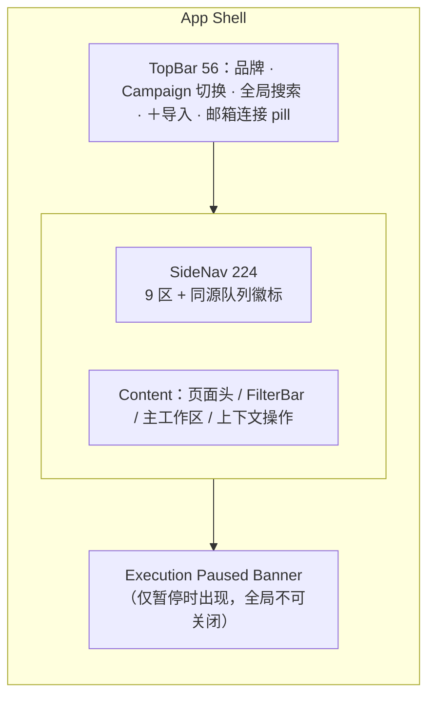

# SmartMail 运营工作台 · 03 Primary Workspace Wireframe（主工作区线框）

| 项 | 内容 |
|---|---|
| 交付物 | 3/3 · Primary Workspace Wireframe |
| 版本 | v0.1（待评审） |
| 日期 | 2026-09-14 |
| 保真度 | 中低保真灰阶线框（grayscale wireframe）：确定**布局、元素位置、组件与功能分区**，不含视觉风格/配色终稿 |
| 约定 | 线框内标签使用英文以保持等宽对齐；每个线框后附中文分区注释。🧭 = Ticket 12 路线图，禁用态预留 |
| 导航 | [01 Workflow Map](./01-workflow-map.md) · [02 Information Architecture](./02-information-architecture.md) · 03 Primary Workspace Wireframe（本文） |

---

## 1. 主工作区的选定与理由

**Primary Workspace = 任务运营工作台（Outreach Task Operations）**，即"外联任务"页的**持久化主从布局（persistent master–detail）**：

- 系统中 80% 的坐班时间花在"扫描在制任务 → 定位问题 → 就地处置"；Task 是领域脊柱对象，所有队列最终都落到它；
- 企业级数据作业遵循 **筛选区 → 高密度列表 → 上下文详情/操作** 三段式（对照经验：卡片列表会牺牲批量扫描与列对齐效率，故主视图采用紧凑表格而非卡片）；
- 深度作业（制备编辑、执行台账、计划审阅）从右侧面板跳入独立页面，返回时保留列表位置与筛选。

设计基准分辨率 **1440 × 900（桌面端，单机内部工具，不做移动端）**。

---

## 2. 应用外壳与栅格

### 2.1 栅格与尺寸规格

| 规格 | 值 |
|---|---|
| 间距基准 | 8pt 栅格（4 / 8 / 12 / 16 / 24 / 32） |
| 顶栏 TopBar 高 | 56px，常驻 |
| 侧栏 SideNav 宽 | 224px（展开）/ 64px（折叠，仅图标） |
| 内容区内边距 | 24px，最大内容宽 1600px 居中 |
| 主从布局 | 列表 flex（min 480）＋ 详情面板 520px（可收起为 0） |
| 抽屉 Drawer | 480px（证据、附件选择） |
| 授权弹层 Modal | 720px，最大高 85vh，正文区滚动 |
| 表格行高 | 紧凑 32px（默认）/ 舒适 40px；表头固定 |
| 响应式 | ≥1440 理想；1280 面板缩至 440；1024–1280 面板变浮层抽屉；<1024 显示"请使用桌面端"提示页 |

### 2.2 外壳分区示意（Mermaid 区块图）



---

## 3. 主工作区线框：任务运营工作台（1440 基准）

```text
┌──────────────────────────────────────────────────────────────────────────────────────────────────────┐
│ ◈ SmartMail   │ Campaign [ 2027 outreach ▾ ]      🔍 Search task / student / supervisor / material     │
│               │                                      [ ＋ Import ]      ● wangyu@163.com ▾      ? ○ │ 56
├───────────────┼──────────────────────────────────────────────────────────────────────────────────────┤
│ ▸ Dashboard   │  Outreach Tasks                                              ⟳ Refresh mailbox evidence │
│ █ Tasks    42 │  42 tasks · 7 blocked · 3 ready · 1 execution paused                          [ ⤢ ]  │
│   Preparation ├──────────────────────────────────────────────────────────────────────────────────────┤
│     7         │ FILTER  Status [All▾] [●Blocked 7] [●Ready 3] [Confirmed] [Sent]  Flag [Any▾]         │
│   Plans     1 │         Follow-up [Any▾] Supervisor [      ] Institution [      ] Mailbox [      ]   │
│   Execution 1 │         [ 💾 Saved views ▾ ]                                      [ Clear ] [ ⚙ ]     │
│   Mailbox   2 ├───────────────────────────────────────────────────────────────────┬──────────────────┤
│   Replies   5 │ ☐ │ Student   Supervisor        Inst.  Msg state     Bl Dup FL ⏎ │ │ DETAIL PANE 520  │
│   Reports     │───┼───────────────────────────────────────────────────────────────┤ │                  │
│   Settings    │ ☐ │ Li Ming   Chen Weiwang       NUS    ● Ready         0  ✓  –   │ │ (see §4 frame)   │
│               │ ☑ │ Wang Yu   A. Smith           NTU    ▲ Blocked       2  !  ●  ●│ │                  │
│               │ ☐ │ Zhao Lin  Patel, R.          HKU    ■ Confirmed     0  ✓  –   │ │                  │
│               │ ☐ │ Sun Hao   Lee Meng           NTHU   ◆ Sent          0  ✓  ✓  ●│ │                  │
│               │ ☐ │ …                                                                │ │                  │
│               │───┴───────────────────────────────────────────────────────────────┤ │                  │
│               │ 2 selected → [ Review & Confirm ] [ Add to plan ] [ Duplicate check ]│ │                  │
│               │                                              Rows/page 50 ▾  ◀ 1 2 …9 ▶│ │                  │
├───────────────┴───────────────────────────────────────────────────────────────────┴──────────────────┤
│ ■ EXECUTION PAUSED · Attempt A-1025 · Unknown Outcome after submission        [ Reconcile now ] [ ▾ ] │
└──────────────────────────────────────────────────────────────────────────────────────────────────────┘
```

### 3.1 分区注释（A–J）

| 区 | 名称 | 元素与行为 |
|---|---|---|
| A | 顶栏 TopBar | Campaign 切换器是**全局作用域**，切换后整页数据刷新且需二次确认（防误切）；全局搜索仅检索不执行动作；`＋Import` 永远要求显式选 Campaign+Student；邮箱 pill 显示地址、连接态、能力小图标，点击进"连接与能力"页 |
| B | 侧栏 SideNav | 9 个一级区；徽标数字与 Dashboard 队列同源；当前区高亮；可折叠为图标栏；异常/暂停类数字用红/琥珀点强提示 |
| C | 页面头 | 标题 + 作用域内摘要句（总数/关键状态计数）；`⟳ Refresh` 触发**只读邮箱刷新**（绝不改变任何外发状态）；`⤢` 隐藏详情面板进入全宽列表 |
| D | 筛选区 FilterBar | 状态 chip 多选（同报告枚举口径）；查重/跟进状态下拉；三个实体选择器；已激活条件以可单独关闭的 chip 回显；Saved views 保存筛选组合 |
| E | 任务主表格 | 紧凑高密度、表头固定、可排序；列：选择框/Student/Supervisor/Institution/消息状态/Bl 阻断数/Dup 查重/FL 跟进/⏎ 回复；行点击=在右面板打开详情；状态列使用颜色+文本+形状三重编码 |
| F | 批量操作条 | 勾选后从表底升起，仅出现**对所选行合法**的动作；`Review & Confirm` 打开逐条授权弹层（§5）；存在不合法行时明示"n 行不可操作及原因" |
| G | 分页 | 高密度运营场景默认 50 行/页；记住每页偏好 |
| H | 详情面板 | 见 §4；可收起；内部深度链接可打开独立详情页 |
| I | 全局暂停 Banner | 仅在 Execution Flow 暂停时出现，不可关闭；主按钮随暂停原因变化（见 §5.2）；▾ 展开多暂停队列 |
| J | 空态 | 首次使用：引导"创建 Campaign / 登记 Student / 导入材料"三步卡；筛选无结果：保留筛选并给"清除条件"动作 |

### 3.2 关键行内状态示意

```text
  ● Ready          绿描边圆点 + 文本      （可进入复核，未授权）
  ▲ Blocked (2)    红三角 + 阻断计数      （行尾"Fix →"直达异常区）
  ■ Confirmed      蓝方块                （摘要已绑定，等待/正在执行）
  ◆ Sent           绿菱形                （不可变事实）
  ◷ Scheduled 🧭   青色时钟（禁用态轮廓） （能力未验收前灰条纹）
  ? Unknown        灰底条纹问号           （唯一动作：先对账）
  ✓ / ! / –  Dup列：无重复(带覆盖度) / 疑似或歧义 / 未查重
  ● / ○ / –  FL列：有回复(普通/自动/歧义点) / 跟进进行中或Due / 无
```

---

## 4. 详情面板线框（Detail Pane 520）

```text
┌ Task T-1042 · Wang Yu → A. Smith ³                       ⤢ full page   × ┐
│ Nanyang Tech. University · wangyu@163.com                 ▲ 2 blockers    │
│                                                                             │
│  ①            ②            ③            ④            ⑤                    │
│  Prepared ─── ● Ready ─── ○ Confirmed ─ ○ Sent/Sched ─ ○ Follow-up         │
│                                                                             │
│ [ Overview │ Content │ Evidence │ Ledger │ Replies │ History ]             │
│═════════════════════════════════════════════════════════════════════════│
│ READINESS · 2 blocking findings                                             │
│ ✕ Recipient conflicts with supervisor's recorded address      [ Fix → ]    │
│ ✕ Supervisor identity not confirmed              [ Confirm identity ]     │
│                                                                             │
│ DUPLICATE CHECK                                          ⚑ Suspected [View]│
│ Coverage  Sent ▮▮▮▮▮ 5/5p   Inbox ▮▮▮▯▯ 3/5p   ⓘ 2 custom folders excluded │
│                                                                             │
│ ATTACHMENTS (active preparation)                                            │
│ ◇ Student CV   suggested: CV_WangYu.pdf  412KB   [✓Confirm][Replace][×]    │
│ ◇ Transcript   ✕ missing — blocking             [Pick source][Upload]      │
│                                                                             │
│ FOLLOW-UP                                                                   │
│ Ordinary reply: none · waiting day 3 / delay 7 · max 2      [ Rule details ]│
│                                                                             │
│ Recent events                                                               │
│ 09-14 09:12  Preparation revalidated · subject corrected                    │
│ 09-13 17:40  Import #12 associated draft P-5521                              │
│───────────────────────────────────────────────────────────────────────────│
│ Confirm & Send  (locked: resolve 2 blockers first)                          │
│ [ Open preparation editor → ]   [ Rewrite… ]   [ Full task page ↗ ]        │
└───────────────────────────────────────────────────────────────────────────┘
```

### 4.1 面板设计说明

- **阶段步进条（①–⑤）**：只点亮已达到的阶段；点击可跳转到对应 Tab；Ready 与 Confirmed 视觉严格分离（不同色、不同形）。
- **Tab = 信息架构中任务详情的六个视图**（History 在窄面板折叠进下拉）。
- 每个 finding 行：结论 + 依据（来源 chip/覆盖度条）+ 行内处置动作，操作员不需要离开面板即可清零异常；动作执行后整份 Preparation 自动重新校验。
- **覆盖度条（Coverage bar）**：结论与覆盖范围强制同屏；缺口（未识别文件夹/失败页）用 ⓘ popover 说明"未发现重复 ≠ 全邮箱无重复"。
- **附件槽位卡**：advisory 建议态 / 已确认快照（显示大小+SHA 前缀）/ 阻断缺失态三态明确；确认后的字节不可变，替换走新快照。
- **底部动作栏**：主 CTA 按状态机启用/禁用并解释禁用原因（`locked: resolve 2 blockers first`）；永不出现绕过闸门的动作。
- Rewrite 是次级危险动作（`Rewrite…`），弹确认说明：旧版隐藏可查、纠正/附件/Confirmation 不继承、存在活跃 Attempt 时禁止。

---

## 5. 关键安全组件线框（本系统的设计重心）

### 5.1 Confirmation 授权弹层（唯一外发入口，720px）

```text
┌ Confirm exact communication · 2 selected                            ✕ ┐
│  ◀ 1 / 2 ▶                                            review each item    │
│                                                                          │
│ FROM       wangyu@163.com                                                 │
│ TO         prof.smith@ntu.edu.sg                                          │
│            ³ known address for this supervisor   [show all addresses]    │
│ SUBJECT    PhD supervision enquiry – Wang Yu                              │
│ ATTACH     CV_WangYu.pdf   412 KB    sha256 9f2a…c13   ✓ frozen snapshot │
│            Transcript.pdf  288 KB    sha256 77bd…09a   ✓ frozen snapshot │
│ READINESS  0 blocking findings                                            │
│ DUPLICATE  No Duplicate Found                                             │
│            Coverage: Sent 5/5 pages · Inbox 3/5 pages  ⓘ gaps listed     │
│ ┌ BODY — frozen preview (scroll to end required) ──────────────────────┐ │
│ │ Dear Professor Smith,                                                  │ │
│ │ I am a final-year …                                                    │ │
│ │ …                                                                      │ │
│ └────────────────────────────────────────────────────────────────────────┘ │
│ EXECUTION  ◉ Immediate after confirmation   ○ Add to a sending plan       │
│ VALIDITY   Confirmation expires at [ 2026-09-16 18:00 ] (optional)        │
│                                                                            │
│ ☐ I have reviewed the exact content and every attachment above             │
│                                              [ Cancel ] [ Confirm → ]     │
└────────────────────────────────────────────────────────────────────────────┘
```

防错设计：① 多选时强制 1/n 逐条翻阅，不可整批跳过；② 正文滚动到底前确认复选框置灰；③ 展示冻结快照与摘要，提交前 Native Host 复核同一摘要；④ 执行方式（立即/加入计划）显式二选一；⑤ 弹层内只读，任何改动需关闭后去编辑，编辑使旧 Confirmation 失效；⑥ 主按钮危险色且固定在底部右侧，Enter 不触发（防误回车）。

### 5.2 全局暂停 Banner（原因驱动的上下文动作）

```text
┌ ■ EXECUTION PAUSED ────────────────────────────────────────────────────────┐
│ Attempt A-1025 (Task T-1043) · Unknown Outcome after submit · 09:13        │
│ Evidence: submission crossed boundary, no unique Sent-folder match yet.    │
│ Blind retry is blocked.                                          [ Reconcile now ▸ ] [ Stop ] │
└────────────────────────────────────────────────────────────────────────────┘
```

五种原因 → 主按钮映射（与 Workflow Map F6 一致）：Unknown→Reconcile；认证/CAPTCHA→I've finished signing in；新 Blocker/重复/回复→Review evidence；confirmation_expired→Re-plan & re-confirm；失败→View evidence / Takeover。多暂停同时存在时 ▾ 展开队列，按风险（Unknown/认证 > Blocker > 过期）排序。

### 5.3 证据三件套组件

```text
 🔘 Source chip          9f2a…c13  SHA chip          Coverage chip
 ┌─────────────────────┐ ┌──────────────────────┐ ┌──────────────────────────┐
│ 📄 draft_..._NTU.docx │ │ sha256 9f2a…c13  ✓   │ │ Sent ▮▮▮▮▮  Inbox ▮▮▮▯▯ │
│ row 12 · cell B4  ⓘ  │ │ snapshotted 09-13    │ │ ⓘ 2 folders not in scope│
│ [open copy] [locate] │ └──────────────────────┘ └──────────────────────────┘
└─────────────────────┘
```

任何系统生成的字段值旁挂 Source chip；任何已确认附件挂 SHA chip；任何"无/否"类结论（无重复、无歧义）挂 Coverage chip。三者均为只读、点开 Drawer 展示完整证据。

### 5.4 🧭 能力未验收控件（Ticket 12 预留样式）

```text
 ┌────────────────────────────────────────────────────────┐
 │ ◷ Native schedule      [ Not verified · disabled ]  ⓘ  │
 │ ✕ Cancel schedule      [ Not verified · disabled ]  ⓘ  │
 │ ↺ Replace schedule     [ Not verified · disabled ]  ⓘ  │
 │ ⤺ Recall               [ Platform-gated · disabled ] ⓘ │
 └────────────────────────────────────────────────────────┘
```

控件**可见但不可点**（而非隐藏），ⓘ 说明验收状态与风险；能力矩阵位于"邮箱与对账"页，逐项 enabled/disabled/verified。

---

## 6. 配套页面缩略线框

### 6.1 Dashboard / 控制塔（一级页）

```text
┌ Workbench — today ─────────────────────────────────────────────────────────────┐
│ NEEDS ACTION (same counts as SideNav badges)                                    │
│ ┌───────────────────────────┬───────────────────────────┬───────────────────┐  │
│ │ ▲ Blocked preparations  7 │ ⚠ Ambiguous replies     2 │ ◷ Follow-ups due 5│  │
│ │ └──────────────────────────┴───────────────────────────┴───────────────────┘  │
│ │ ? Unknown outcomes       1 │ ■ Proposed plans         1 │ ⏸ Paused flows  1│  │
│ └───────────────────────────┴───────────────────────────┴───────────────────┘  │
│ ┌ EXECUTION FLOW ───────────────┐ ┌ CAMPAIGN PIPELINE (WIP) ────────────────┐  │
│ │ Running 0 · Paused 1          │ │ Planned 18 → Ready 12 → Confirmed 6     │  │
│ │ Recent attempts (5 rows)      │ │ Sent 31 · Failed 1 · Unknown 1          │  │
│ │ [Go to monitor]               │ │ Funnel bar ▰▰▰▰▰▰▰▰▱▱                  │  │
│ └───────────────────────────────┘ └─────────────────────────────────────────┘  │
│ ┌ UPCOMING PLAN SLOTS 🧭/local ─┐ ┌ RECENT ACTIVITY ───────────────────────┐  │
│ │ Today 09:00 T-1055   ✓confirmed│ │ 09:14 Follow-up P-5530 became due     │  │
│ │ Today 10:00 T-1056   proposed │ │ 09:12 Import #12 finished: 1 finding   │  │
│ │ Tomorrow 2 slots …            │ │ 09:05 Attempt A-1024 Sent (evidence)   │  │
│ └───────────────────────────────┘ └─────────────────────────────────────────┘  │
└─────────────────────────────────────────────────────────────────────────────────┘
```

每张队列卡=带预设筛选的任务列表入口；漏斗只呈现 spec 允许的运营状态，不做语义转化/时机指标。

### 6.2 制备编辑器（独立页，三栏）

```text
┌ Preparation P-5521 · Task T-1042 (Active) ───────────────────────────────────────┐
│ LEFT 360: fields + findings          │ CENTER: body editor      │ RIGHT: preview │
│ Subject [PhD supervision enquiry…] 🔍│ ┌──────────────────────┐ │ ┌────────────┐ │
│ Recipient [prof.smith@ntu.edu.sg] ⚠  │ │ Dear Professor Smith,│ │ │ MESSAGE    │ │
│  ⚠ conflicts recorded address [Fix]  │ │ …                     │ │ │ PREVIEW    │ │
│ Attachment slots:                    │ │                       │ │ │ From/To/…  │ │
│ ◇ Student CV  CV_WangYu.pdf 412KB    │ └──────────────────────┘ │ │ (read-only)│ │
│   [Confirm][Replace][Remove]         │ Transformation records ▾ │ └────────────┘ │
│ ◇ Transcript ✕ missing (blocking)    │ · cleanup: whitespace…   │ Evidence chips  │
│   [Pick source][Upload]              │ · note separated (rule4) │ beside fields   │
│──────────────────────────────────────┴──────────────────────────┴────────────────│
│ [Rewrite from new source…]            [ Save corrections ]   [ Revalidate → ]    │
└──────────────────────────────────────────────────────────────────────────────────┘
```

字段旁的 🔍 打开权威来源抽屉；保存=显式操作员输入留痕；Rewrite 走危险确认。

### 6.3 Sending Plan 审阅页

```text
┌ Sending Plan #7 ─ constraints: Asia/Shanghai · MON–FRI 09:00–17:00 · 60 min · 2/day · horizon 3 d ┐
│ [Re-propose]                                                                          [Configure ▾]│
│ ┌ Mon 09-15 ────────────────────────┐ ┌ Tue 09-16 ─────────────────────────┐                    │
│ │ 09:00 T-1055 Lee Meng       ✓conf.│ │ 09:00 T-1057 Goh W.L.       ✓conf. │                    │
│ │ 10:00 T-1056 Patel R.       [adj] │ │ 10:00 T-1058 Tan B.H.       [adj]  │                    │
│ └───────────────────────────────────┘ └────────────────────────────────────┘                    │
│ Unavailable (3):  not_ready ×2 · already_sent ×1            (listed, never dropped)              │
│ Impossible (1):   T-1090 binding constraint: daily_limit     [show arithmetic]                    │
│ Adjust dialog: datetime + timezone + live validation (window/spacing/limit/past-time)             │
│                                                          [ Confirm whole plan (4 actions) → ]     │
└───────────────────────────────────────────────────────────────────────────────────────────────────┘
```

### 6.4 执行监控页

```text
┌ Execution — flow stepper (per attempt) ──────────────────────────────────────────────────────────┐
│ ⓿ Reconcile → ⓿ Duplicate re-check → ⓿ Confirmation/permit → ⓿ Compose → ⓿ Attach → ⓿ Send → ⓿ Sent evidence │
│ ┌ ATTEMPTS (table) ───────────────────────────────────────────────────────────────────────────┐  │
│ │ A-1024 T-1042 ◆ Sent      09:12  sent-folder match unique        S-901 [evidence]            │  │
│ │ A-1025 T-1043 ? Unknown   09:13  no unique match yet             [Reconcile][Takeover][Stop] │  │
│ │ A-1026 T-1044 ◌ Queued    —     waits on paused batch            [Resume when clear]         │  │
│ └───────────────────────────────────────────────────────────────────────────────────────────────┘  │
│ External commitments 🧭 (visible while local paused): 2 scheduled drafts remain active in 163    │
└───────────────────────────────────────────────────────────────────────────────────────────────────┘
```

---

## 7. 组件清单与状态矩阵

| 组件 | 变体 | 关键状态 | 使用规则 |
|---|---|---|---|
| Button | primary / secondary / danger / ghost | default / hover / active / focus / disabled+原因 / loading | 外发类只允许 primary；stop/rewrite/cancel 用 danger；禁用必须附原因 tooltip |
| Status Badge | 5 套枚举（见 IA §8） | normal / emphasized(行内计数) | 颜色+文本+形状三编码；Unknown 用条纹纹理 |
| Filter Chip | 单选/多选 | active / dismiss | 可单独 × 关闭；激活即生效，URL query 同步可分享 |
| Data Table | compact/comfortable | sort / select-all / indeterminate / expanded / loading / empty | 表头固定；批量动作条仅勾选时出现；数字右对齐 |
| Master–Detail Pane | pinned 520 / overlay 抽屉 / hidden | loading / not-found / locked-action | 深度操作跳独立页；返回保留滚动与选择 |
| Modal | confirm / form | scroll-guard(授权) / danger-check | 焦点陷阱；Esc=Cancel；危险按钮不响应 Enter |
| Drawer | evidence / picker | 480，非阻断列表 | 用于证据与附件选择，不承载主动作 |
| Banner | paused (全局) / warning (页内) | 不可关闭 / 可关闭 | 只有暂停 Banner 不可关闭 |
| Coverage Bar | folder segments | complete / partial / excluded-hover | 悬停列出范围与缺口，文案固定带限定语 |
| Attachment Slot | suggested / confirmed / missing-blocking / added | 三态 + SHA 展开 | 建议永不自动确认；确认即快照 |
| Stepper | task-stage / execution-step | done / current / locked | 点击仅作导航，不改变状态 |
| Toast | success / info（无 success-for-external） | 自动消失 | 外部结果只以证据页为准，toast 只告知"刷新完成" |
| Connection Pill | connected / wrong-mailbox / auth-required / host-down | 四态文案+排查入口 | 常驻顶栏；点击进能力页 |
| Empty State | first-run / no-filter-result / paused-local-work | 插画位+主引导动作 | 永远给下一步，不留空白页 |

---

## 8. 交互与可用性规范（要点）

1. **反馈层级**：行内即时校验 → 页内 Banner → 全局暂停 Banner → Modal；外部操作结果不依赖 toast，必须落到台账证据。
2. **乐观更新边界**：仅本地字段纠正可乐观更新并提供撤销；Confirmation、Execution、Reconciliation 一律等待核心返回。
3. **危险操作文案公式**：动作 + 对象 + 不可逆后果（例："Stop A-1025 将释放该尝试；之后才可 Rewrite，且不改变邮箱实际状态。"）。
4. **键盘**：`/` 聚焦搜索；`↑/↓` 移动表格行；`Enter` 打开详情；`Esc` 关闭弹层/抽屉；弹层内焦点陷阱；Tab 顺序符合视觉顺序。
5. **可访问性**：所有状态有色盲安全的形状冗余；文本对比度 ≥ 4.5:1；图标按钮带 aria-label；覆盖度缺口等限定信息不仅用颜色表达；暂停区 `role="alert"`。
6. **密度与效率**：默认紧凑行高、列宽可调并记忆；批量复核支持键盘逐条下一条；筛选可保存为视图。
7. **数据诚实**：任何定时刷新不得在后台改变外部状态；轮询只刷新观测；能力未验收与 Unknown 状态无任何绿色成功语义。
8. **一致性**：队列计数在侧栏/Dashboard/页头三处同源同值（同一查询）；同一枚举全系统同名同图标。

---

## 9. 尼尔森启发式自查（节选）

| 启发式 | 落点 |
|---|---|
| 系统状态可见 | 顶栏连接态、阶段步进、Execution 三阶段证据、全局暂停 Banner |
| 真实世界映射 | 全部采用领域词汇（Outreach Task / Preparation / Confirmation / Reconciliation），不造系统黑话 |
| 用户控制与自由 | 面板可收起、视图可保存、停止/接管/对账均由操作员发起；无不可逆的隐式动作 |
| 一致性与标准 | 枚举字典统一（IA §8），状态三编码，动作位置固定 |
| 防错 | 授权弹层滚动守卫、摘要复核、禁用按钮附原因、Wrong-mailbox 零落库、禁盲重试 |
| 识别而非回忆 | 证据 chip 就地呈现；筛选条件回显；面包屑保留作用域 |
| 灵活高效 | 批量操作、保存视图、键盘导航、紧凑密度 |
| 美观简约 | 灰阶线框阶段即排除装饰性元素；每屏只服务当前阶段决策 |
| 错误恢复 | 每种暂停原因对应唯一主动作；Rewritten/Unknown 均给出恢复路径而非死胡同 |
| 帮助文档 | ⓘ 覆盖度/能力状态内嵌说明；设置页保留 CLI 等价命令备查（可追溯性） |

---

## 10. 本交付物边界与建议的下一步

- 本文件只定义结构与交互骨架，**不含视觉风格（色板、字体、组件视觉稿）与可点击原型**。
- 建议的后续顺序（需评审通过后再启动，仍不触碰核心代码）：
  1. 用 1–2 个真实场景（晨间批处理 + Unknown 恢复）走查本线框，校准信息密度与动作顺序；
  2. 产出 Design Tokens 与高保真视觉稿（含完整暗色/浅色与状态色）；
  3. 制作可点击 Prototype（建议覆盖：队列→授权弹层→暂停控制台三个关键路径）；
  4. 前端技术方案与命令/查询边界的 API 映射（headless core 已是稳定边界，前端仅做编排）。

---

> 返回：[01 Workflow Map](./01-workflow-map.md) · [02 Information Architecture](./02-information-architecture.md)
