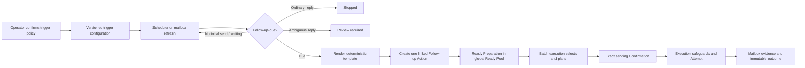

# Follow-up automation: trigger to Ready Pool

## Responsibility boundary

The operator configures one Campaign trigger policy: delay after the latest Sent
Record, maximum Follow-up count, deterministic subject and body templates, local
trigger time, timezone and enabled state. Saving an enabled policy confirms that
SmartMail may create a linked Follow-up Action when those conditions become true.
It does **not** authorize sending that action.

Follow-up owns eligibility evaluation, reply gates, deterministic rendering and
single-action creation. It stops after handing a Ready Preparation to the global
Ready Pool. Batch execution exclusively owns selection, scheduling, exact sending
Confirmation, duplicate/readiness rechecks, Execution Attempts and outcomes.

## Runtime flow

The scheduler calls only `process_follow_up_automation(campaign_id)`. That interface
may create Actions and Preparations; it never creates a sending Confirmation, an
Execution Attempt or a mailbox request. Repeated calls are idempotent because an
open Action keeps the Task out of the due state. Consequently one substantive due
condition produces one Action and one Preparation.

## Trigger semantics

- The anchor is the latest Sent Record for the Outreach Task.
- The due date is the anchor's local calendar date plus `delay_days`, at the
  configured trigger time in the configured IANA timezone.
- A reliably Associated Ordinary Reply stops eligibility. A Recognized Automatic
  Reply does not. An ambiguous association holds the Task for review.
- `maximum_count` counts linked Follow-up sends; only one open Follow-up Action may
  exist for a Task.
- Templates may use only recorded values: `supervisor_name`, `student_name`,
  `institution` and `original_subject`.

## Confirmation and safety

The trigger policy stores a revision, SHA-256 policy digest and confirmation time.
Every created Follow-up Action records the revision and digest that caused it. A
policy edit applies to future eligibility evaluations; it does not rewrite or
re-trigger an already created Action.

“Configured timing equals Confirmation” therefore means confirmation of trigger
creation only. It is intentionally different from the exact sending Confirmation
bound to Preparation content, attachment bytes and an execution plan. Batch
execution creates that exact Confirmation and rechecks readiness, duplicate
evidence, newly Associated Ordinary Replies, mailbox capability and Execution Flow
state before any external request.

## Frontend integration

`#mailbox` is the signal-and-trigger workspace. Its three-stage strip makes the
boundary visible: Mailbox signal → Follow-up trigger → global Ready Pool. Current
observation facts and trigger states stay in independently scrollable regions. The
trigger policy opens in a modal so the main surface remains an operational monitor,
and a direct handoff opens Batch execution. The page contains no send control.

`FollowUpAutomationDriver` lives under the Mailbox module but mounts at app scope.
While the local desktop app is running, it evaluates the selected Campaign on mount,
focus and every 30 seconds while visible. Core owns idempotency. Triggered Ready
Preparations appear through the existing execution queue rather than a parallel
Follow-up queue.

Records owns historical Mailbox Observations, coverage, Reconciliation findings,
replies, Follow-up Actions, Confirmations, Attempts and Sent Records. Mailbox shows
only the current signal and summary. Navigation places Mailbox immediately before
Batch execution to match the ownership sequence.
