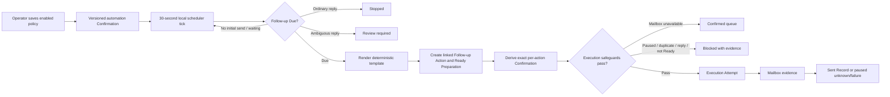

# Follow-up automation: trigger to execution

## Human and system responsibility

The operator configures one Campaign policy: delay after the latest Sent Record, maximum Follow-up count, deterministic subject and body templates, local send time, timezone, and enabled state. Saving an enabled policy is the **Follow-up Automation Confirmation**. There is no later per-message confirmation step.

SmartMail owns everything after that save: eligibility evaluation, reply gates, template rendering, linked Follow-up Action creation, exact Confirmation derivation, duplicate and readiness checks, execution entry, outcome recording, and retry refusal. A policy edit creates a new revision and invalidates pending Confirmations derived from the prior revision.

## Runtime flow

The scheduler calls only `process_follow_up_automation(campaign_id)`. That interface is intentionally deep: callers do not create Preparations, Confirmations, Attempts, or Sent Records themselves. Repeated calls are idempotent; an open Action prevents a second Action, an active exact Confirmation is reused, and any existing Attempt prevents automatic retry.

## Trigger semantics

- The anchor is the latest Sent Record for the Outreach Task.
- The due date is the anchor's local calendar date plus `delay_days`, at the configured `send_time` in the configured IANA timezone.
- A reliably Associated Ordinary Reply stops eligibility. A Recognized Automatic Reply does not. An ambiguous association holds the Task for review.
- `maximum_count` counts linked Follow-up sends; only one open Follow-up Action may exist for a Task.
- Templates may use only recorded values: `supervisor_name`, `student_name`, `institution`, and `original_subject`.

## Authorization and safety

The standing policy stores a revision, SHA-256 policy digest, and confirmation time. Every derived exact Confirmation records that revision and digest in its execution details and remains bound to the Preparation content and attachment digests. Saving a changed policy invalidates pending automation-derived Confirmations; the next scheduler pass regenerates content when necessary and derives a new exact Confirmation.

Before any mailbox request, the existing Execution module rechecks active Confirmation, exact content, attachment bytes, Ready state, duplicate evidence, newly Associated Ordinary Replies, mailbox capability, and Execution Flow state. Unknown outcomes and failures pause the flow and are never retried by the scheduler.

## Frontend integration

`#mailbox` combines current mailbox monitoring with Follow-up automation because mailbox observations are the evidence that starts or stops no-reply eligibility. Its left bounded region is the only operator input surface; the right bounded regions show live monitoring, trigger status, and the policy → exact Confirmation → Attempt handoff. The page contains no domain decisions and offers no direct send control.

`FollowUpAutomationDriver` lives under the Mailbox page module but mounts at app scope. While the local desktop app is running, it evaluates the selected Campaign on mount, focus, and every 30 seconds while visible. Core owns idempotency and all external effects. The existing Batch execution page receives derived Confirmations and Attempts through its existing read model; no parallel queue was introduced. Historical Observation batches, coverage, Reconciliation findings, replies, Follow-up Actions, Confirmations, Attempts and Sent Records are inspected in Records.

If the mailbox capability is unavailable, the exact Confirmation stays in the existing execution queue. If the flow is paused, the scheduler creates no Attempt. The automation currently follows the globally selected Student/Campaign scope because that scope also identifies the mailbox the extension must match.
