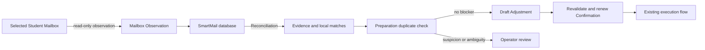

# First frontend page

The React page maps the reference canvas to existing Core concepts, rather than
introducing a configurable workflow engine. Its node counts are sets of Outreach
Tasks and may overlap across Communication Actions. Connections describe supported
paths, not execution history or automatic transitions.

## Canonical lifecycle

The arrow into the database means persistence of evidence, not a mailbox sync.
The database keeps external observations and local Preparations as separate
records. Reconciliation can create associations and findings; it never silently
changes a Preparation. A Draft Adjustment is valid only for an active local
Preparation whose external commitment is resolved.

| Stage | Existing Core evidence |
| --- | --- |
| 读取外部邮箱 | `refresh_mailbox` through the existing read-only 163 extension; produces a Mailbox Observation |
| SmartMail 数据库 | Persists Mailbox Observations, coverage and Reconciliation findings alongside local records |
| 比对与查重 | Read-time Reconciliation, followed by per-Preparation `check_duplicate` |
| Source materials | Campaign Outreach Tasks from `operations_report` |
| 更新 / 调整草稿 | Active `list_preparations`, Draft Adjustment corrections and source-based Rewrite |
| Ready preparation | Core readiness findings have zero blockers |
| Confirmation | Recorded active `list_confirmations`; execution still rechecks validity |
| Operator review | Task exceptions, Preparation blockers, or duplicate suspicion |
| Externally scheduled | Reported mailbox schedule observations |
| Sent record | Reported sent outcome backed by the execution ledger |
| Observed failure / Unknown outcome | Separate report states; never conflated |
| Associated reply | Ordinary reply received in Core follow-up evaluation |
| Follow-up due | Core Follow-up Rule eligibility |

The task inspector calls `report_task` for active Preparation content, attachment
associations, readiness findings, original Source Material names, duplicate
coverage and Execution Attempts. Campaign creation and duplicate checks directly
call `create_campaign` and `check_duplicate`. The editor calls atomic
`update_preparation_fields` (existing correction/readiness rules, with confirmation
invalidation) and `rewrite_local_preparation` (existing Rewrite plus a guard against
modifying external commitments). No UI code performs readiness,
duplicate, reply, scheduling or sending decisions.

## Local transport

The Vite development server proxies an allowlisted JSON protocol over private
stdio to one long-lived `python -m smartmail.ui` process. A single Core instance
avoids invoking restart recovery on every UI query. Vite binds to loopback and
requires same-origin JSON POST requests, with bounded request sizes and timeouts.
The Python bridge owns no network listener. It exposes the read-only mailbox
refresh command; sending, scheduling, cancellation and Recall remain unavailable
through the UI bridge. The adapter uses a 20-second timeout within the UI bridge
request deadline, and all external write capabilities remain disabled.
ADR-0001's extension Native Messaging boundary remains unchanged.

This is a local development frontend. `npm run build` checks and bundles the UI;
the static build and `vite preview` alone do not start the Core bridge. Startup
uses Core's existing lifecycle/recovery, just like the CLI. Do not open this
workspace against a store that is currently executing in another process.

Import, confirmation, execution, scheduled replacement and follow-up creation
continue through the existing CLI. The UI can read the connected mailbox, inspect
its saved observation batches and reconciliation findings, correct local subject and
recipient, and Rewrite from an already imported document selected by filename. The in-page
guide explains intake setup. No sample campaigns or messages are inserted into
the user store.

## Verification

`python -m unittest tests.test_ui` verifies real persisted report/detail payloads,
readiness blockers, duplicate coverage, isolated campaign scope, forbidden
commands, malformed protocol input and Unicode campaign persistence.
`npm run build` and `npm run lint` validate the frontend.

## 读取、入库、比对、草稿调整闭环

1. 操作员明确选择学生邮箱，连接该邮箱的 163 扩展，再点击读取。
2. Core 将邮件元数据、读取批次、状态和覆盖范围持久化，并运行现有对账逻辑。
3. 来源材料与 Mailbox Observation 共同作为数据库中的证据。导入材料负责显式建立任务关联；
   读取邮箱本身不会猜测学生、导师或 Campaign，也不会自动创建 Preparation。
4. 比对在读取时发生；查重由操作员在具体 Preparation 上发起，结果包含覆盖限制。
   重复疑似或冲突进入人工处理。历史批次保留，不把多次观察计作唯一邮件数。
5. 本地草稿可进行 Draft Adjustment，修改主题和收件人；正文替换使用导入文档的 Rewrite，保留旧版本。
   来源选择仅包含当前学生与 Campaign 的导入文档，Core 继续检查导师、机构匹配。
   修改后的草稿重新校验、查重和确认，再进入原有执行流程。
6. 已发送、已被替代、存在未知结果或外部定时承诺的 Preparation 不允许直接调整。
   定时替换仍走既有 Scheduled Replacement 流程。

外部草稿观察与 SmartMail 本地 Preparation 是两个模型。当前扩展提供的列表元数据
不是完整可编辑正文，也不构成覆盖本地草稿或向外部写回草稿的授权。

邮箱观察按学生邮箱保存，独立于 Campaign；任务、查重和草稿列表保持 Campaign 范围。
新入口的计数分别使用“学生邮箱”和“读取批次”，不会冒充任务数。
